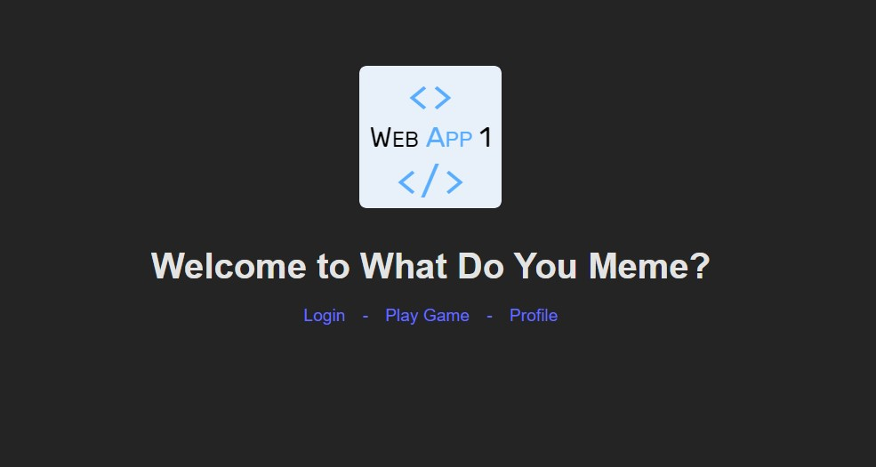
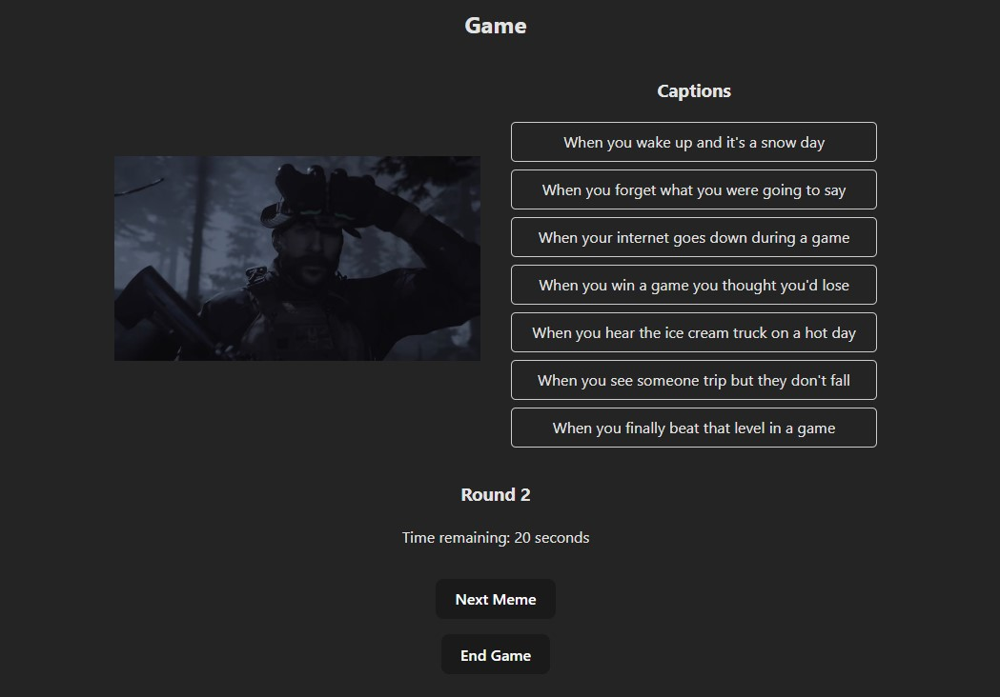

## React Client Application Routes

- Route `/`: Home page and game overview.
- Route `/login`: User login page.
- Route `/game`: Meme round flow (3 rounds, 30 seconds each).
- Route `/profile`: Player profile with recent games and rounds.

## Main React Modules

- Pages: `client/src/pages/*` (Home, Login, Game, Profile)
- Layout: `client/src/components/layout/*`
- API clients: `client/src/api/*`
- Auth context: `client/src/context/AuthContext.jsx`

## API Server

### Authentication
- POST `/api/auth/login`: Authenticates a user and starts a session.
  - Request body: `{ "username": "user", "password": "pass" }`
  - Response: `{ "message": "Logged in", "user": { "id": 1, "username": "user" } }`
  - Errors: `401 Unauthorized` if login fails

- POST `/api/auth/logout`: Logs out the current user and ends the session.
  - Response: `{ "message": "Logged out" }`

- GET `/api/auth/user`: Retrieves the logged-in user's information.
  - Response: `{ "user": { "id": 1, "username": "user" } }`
  - Errors: `401 Unauthorized` if no user is logged in

### Game Flow
- POST `/api/game/start`: Starts a new game and returns the first meme + captions.
  - Response: `{ "gameId": 1, "round": 1, "totalRounds": 3, "meme": {...}, "captions": [...] }`

- POST `/api/game/answer`: Submits an answer for the current meme.
  - Request body: `{ "gameId": 1, "memeId": 1, "captionId": 2, "timeTaken": 12 }`
  - Response: `{ "round": 1, "score": 5, "totalScore": 5, "answeredCorrectly": true, "bestMatches": [...], "gameOver": false, "nextRound": {...} }`

### Profile
- GET `/api/profile/me`: Summary for the logged-in user.
  - Response: `{ "totalScore": 25, "recentGames": [...], "recentRounds": [...] }`

## Database Tables

- Table `users`: Stores user information.
  - Columns: 
    - `id` (INTEGER, PRIMARY KEY): Unique identifier for each user.
    - `username` (TEXT, UNIQUE): Username of the user.
    - `hash` (TEXT): Password hash for authentication.
    - `salt` (TEXT): Salt used for password hashing.

- Table `memes`: Stores meme information.
  - Columns: 
    - `id` (INTEGER, PRIMARY KEY): Unique identifier for each meme.
    - `image_url` (TEXT): Filename for the meme image.

- Table `captions`: Stores caption information.
  - Columns: 
    - `id` (INTEGER, PRIMARY KEY): Unique identifier for each caption.
    - `text` (TEXT): Text of the caption.

- Table `meme_captions`: Associates captions to memes.
  - Columns: 
    - `meme_id` (INTEGER): Foreign key referencing the `memes` table.
    - `caption_id` (INTEGER): Foreign key referencing the `captions` table.
    - `is_best_match` (BOOLEAN): Indicates if the caption is one of the best matches.

- Table `games`: Stores game sessions.
  - Columns: 
    - `id` (INTEGER, PRIMARY KEY): Unique identifier for each game.
    - `user_id` (INTEGER): Foreign key referencing the `users` table.
    - `started_at` (TEXT): Game start timestamp.
    - `ended_at` (TEXT): Game end timestamp.
    - `total_score` (INTEGER): Total score for the game.
    - `rounds_total` (INTEGER): Number of rounds in the game.

- Table `rounds`: Stores each meme round played in a game.
  - Columns:
    - `id` (INTEGER, PRIMARY KEY): Unique identifier for each round.
    - `game_id` (INTEGER): Foreign key referencing the `games` table.
    - `meme_id` (INTEGER): Foreign key referencing the `memes` table.
    - `caption_id` (INTEGER): Foreign key referencing the `captions` table (nullable).
    - `is_correct` (INTEGER): Whether the selected caption was a best match.
    - `score` (INTEGER): Score awarded for the round.
    - `time_taken` (INTEGER): Time spent for the round.
    - `created_at` (TEXT): Round timestamp.

- Table `scores` (legacy): Older scoring table kept for compatibility.
- Table `game_history` (legacy): Older game history table kept for compatibility.

## Screenshots

## Users Credentials

- Registered User1 -> username: user1 & password: password1
- Registered User2 -> username: user2 & password: password2
