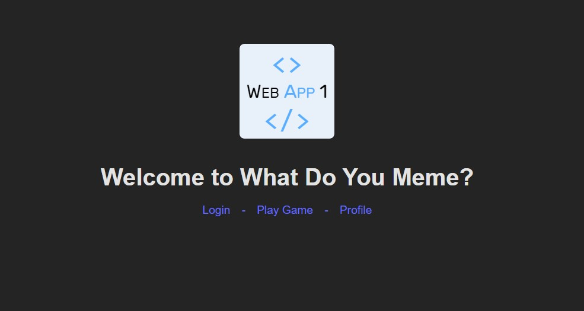

# Exam #1: "Meme Game"
## Student: s324924 KURTOGLU SEFA 

## React Client Application Routes

- Route `/`: Home page displaying general information about the game.
- Route `/login`: User login page.
- Route `/profile`: User profile page showing scores and game history.
- Route `/game`: Main game page where users play the meme caption game.

## Main React Components

- `Home` (in `Home.jsx`): Displays the home page with general information about the game.
- `Login` (in `Login.jsx`): Handles user login.
- `Profile` (in `Profile.jsx`): Shows the user's profile, including scores and game history.
- `Game` (in `Game.jsx`): Main game component where users can play the meme caption game.
- `Navbar` (in `Navbar.jsx`): Navigation bar that appears on all pages.
- `API` (in `API.js`): Contains functions to interact with the backend API.

## API Server

- POST `/api/auth/login`: Authenticates a user and starts a session.
  - Request body: `{ "username": "user", "password": "pass" }`
  - Response: `{ "message": "Logged in" }`
  - Errors: `401 Unauthorized` if login fails

- POST `/api/auth/logout`: Logs out the current user and ends the session.
  - Response: `{ "message": "Logged out" }`
  - Errors: `500 Internal Server Error` if logout fails

- GET `/api/auth/user`: Retrieves the logged-in user's information.
  - Response: `{ "username": "user", "name": "User Name", ... }`
  - Errors: `401 Unauthorized` if no user is logged in

- GET `/api/game/start`: Starts a new game by providing a random meme and its captions.
  - Response: `{ "meme": { "id": 1, "url": "/path/to/meme" }, "captions": [ { "id": 1, "text": "caption1", "is_best_match": true }, ... ] }`
  - Errors: `500 Internal Server Error` if no meme or captions are found

- GET `/api/game/nextMeme`: Provides the next random meme and its captions for the game.
  - Response: `{ "meme": { "id": 2, "url": "/path/to/meme" }, "captions": [ { "id": 2, "text": "caption2", "is_best_match": false }, ... ] }`
  - Errors: `500 Internal Server Error` if no meme or captions are found

- POST `/api/game/submitAnswer`: Submits the user's selected caption for a meme.
  - Request body: `{ "userId": 1, "memeId": 1, "captionId": 1 }`
  - Response: `{ "score": 5 }`
  - Errors: `500 Internal Server Error` if submission fails

- POST `/api/game/recordGameHistory`: Records the game history after a game ends.
  - Request body: `{ "userId": 1, "memeId": 1, "captionId": 1, "score": 5 }`
  - Response: `{ "message": "Game history recorded successfully" }`
  - Errors: `500 Internal Server Error` if recording fails

- GET `/api/profile/:userId/scores`: Retrieves the scores for a specific user.
  - Response: `[ { "gameId": 1, "score": 5 }, ... ]`
  - Errors: `500 Internal Server Error` if retrieval fails

- GET `/api/profile/:userId/totalScore`: Retrieves the total score for a specific user.
  - Response: `{ "totalScore": 15 }`
  - Errors: `500 Internal Server Error` if retrieval fails

## Database Tables

- Table `users`: Stores user information.
  - Columns: 
    - `id` (INTEGER, PRIMARY KEY): Unique identifier for each user.
    - `username` (TEXT, UNIQUE): Username of the user.
    - `hash` (TEXT): Password hash for authentication.
    - `salt` (TEXT): Salt used for password hashing.

- Table `memes`: Stores meme information.
  - Columns: 
    - `id` (INTEGER, PRIMARY KEY): Unique identifier for each meme.
    - `url` (TEXT): URL of the meme image.

- Table `captions`: Stores caption information.
  - Columns: 
    - `id` (INTEGER, PRIMARY KEY): Unique identifier for each caption.
    - `text` (TEXT): Text of the caption.
    - `is_best_match` (BOOLEAN): Indicates if the caption is one of the best matches for the meme.

- Table `scores`: Stores game scores.
  - Columns: 
    - `id` (INTEGER, PRIMARY KEY): Unique identifier for each score entry.
    - `user_id` (INTEGER): Foreign key referencing the `users` table.
    - `meme_id` (INTEGER): Foreign key referencing the `memes` table.
    - `score` (INTEGER): Score achieved by the user for a specific meme.

- Table `game_history`: Records game history.
  - Columns: 
    - `id` (INTEGER, PRIMARY KEY): Unique identifier for each game history entry.
    - `user_id` (INTEGER): Foreign key referencing the `users` table.
    - `meme_id` (INTEGER): Foreign key referencing the `memes` table.
    - `caption_id` (INTEGER): Foreign key referencing the `captions` table.
    - `score` (INTEGER): Score achieved by the user in a specific game.

## Screenshots

## Users Credentials

- Registered User1 -> username: user1 & password: password1
- Registered User2 -> username: user2 & password: password2
